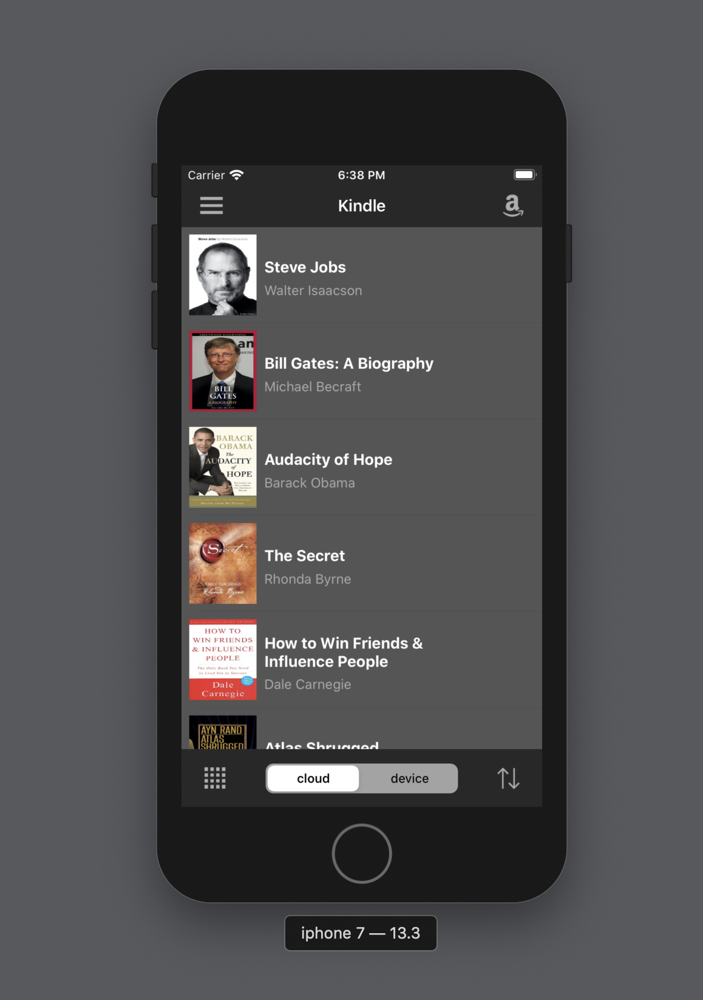

<h1>Project 1 - Kindle clone (Programmatic UI)</h1>
I am learning iOS development in swift.   

This project is from [LetsBuildThatApp](https://www.letsbuildthatapp.com/).   

After reading a few posts and watching a few videos (links below) I have decided to go with the programmatic 
approach. It is slower but will definitely be beneficial in the long run as also underlined by <bold>Sean Allen</bold>. 
  
Project based learning definitely makes things easier though. 

// todo:  
- list of what i learned
- add gif
