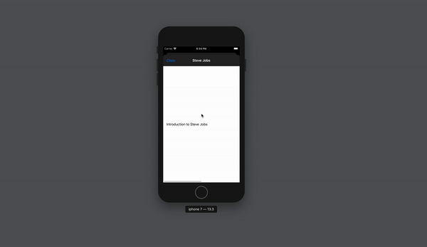

<h1>Project 1 - Kindle clone (Programmatic UI)</h1>
I am learning iOS development in swift.   

This project is from [LetsBuildThatApp](https://www.letsbuildthatapp.com/).   

After reading a few posts and watching a few videos I have decided to go with the programmatic 
approach. It is slower but will definitely be beneficial in the long run as also underlined by <bold>Sean Allen</bold>. 
  
Project based learning definitely makes things easier though. 

 

<h3>What I learned</h3>
<ul>
    <li>UINavigationController</li>
    <li>TableView</li>
    <li>TableFooterView</li>
    <li>TableView custom cell</li>
    <li>CollectionView</li>
    <li>CollectionView pagination</li>
    <li>CollectionView custom cell</li>
    <li>Making API call in swift</li>
</ul>

